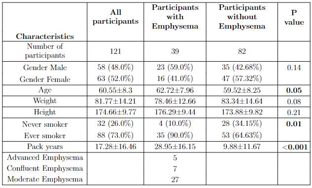

# Interface for blind reading of a nodule from radiologists

> This tool creates a demographics table from attributes extracted from LifeLines data. Participants in each group of interest are specified (here emphysema groups). A table like the one shown below will be created.

The code can be found here [here](/demographics_emphysema_statistics.ipynb)

 

## Contributing
Pull requests are welcome. For major changes, please open an issue first to discuss what you would like to change.

 
## License
[MIT License](LICENSE)
